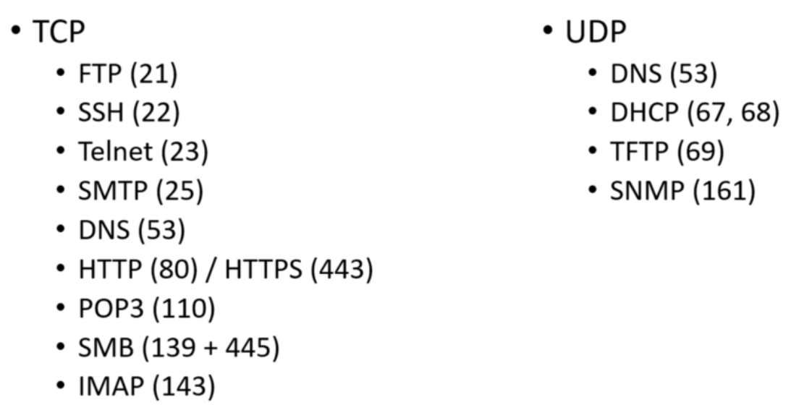

# Common Ports & Protocols

[Full list](https://en.wikipedia.org/wiki/List_of_TCP_and_UDP_port_numbers) of ports can be found on Wikipedia.

## FTP (21)
Client server protocol used for transmission of files between two devices. Requires a FTP server and a FTP client to be used. **Not intended to be secure**, uses clear-text username and password for authentication and does not use encryption. See [**FTPS (port 990)** or **SFTP (port 22 via SSH port)**](https://www.thesecuritybuddy.com/encryption/sftp-vs-ftps/?__cf_chl_jschl_tk__=0dafa17fe38f2f1f78e1322b046456c5fe8fe609-1606046045-0-AVFqWQTBtC1gCeX26eBy6MG8T_8HuKbvY1WmPTve4sTKVXRWKg6NElPX3VmSK5ylLEnUaapRTL6QagbR2V_1VvGGYMLHpKUadcydJ_cP8oj1Imav7Vtrsbdq2MHPnElY2fQPZxTddZUOBjQfqtLNAHg-DCh-0UdmARLBPVIhGXhRPA2nXUawXJGE4iAZ3aqvHEYfKOs9bVYbUwgZatOMMZWJYjg_I3fPr3CcfyPYzGBLuILDKzkPQVh7OztKJVrUfb-w-ZKpncmaaX-_wVec8F49H-H9Q37DIjjgYAriwo1dvqRhUMhsncrMBwRueblYD_e6B8XQUDYD4XYCyvPk0sk) for secure alternatives.

## SSH (22)
An encrypted remote access protocol used for connecting to devices remotely. There exist a paid version of SSH which gives patentend encryption methods. SSH uses public key encryption for authentication. 

## Telnet (23)
Similar to SSH, telnet is also used for connecting to a device remotely. However the crucial difference being that Telnet does not encrypt the traffic between the devices. Specifically designed for LAN networks. In addition, no authentication or privileges are provided for user authentication.

## SMTP (25)
Used for mail transfer and is commonly used for that purpose today. The mail is sent via SMTP and accessed via IMAP (port 143) or POP3 (110). 

## DNS (53)
Used for resolving URLs to IP addresses. So instead of going around trying to remember what `172.217.3.206` points to, we can simply type `www.google.com` in the URL and the DNS will translate `www.google.com` to the appropriate IP and vice versa.

## HTTP (80) / HTTPS (443)
These ports are used for websites. HTTP is simple and communicates data in plain text. HTTPS on the other hand introduces the security aspect, such as encryption of data. 

## POP3 (110)
Used for retrieving email from an email server. 

## SMB (139 + 445)
SMB aka SAMBA, is used for file shares between devices and are very commonly used for file sharing. 

## IMAP (143)
Similarly to POP3, this is used for retrieving emails from a server. 

## DHCP (67 + 68)
A protocol that is responsible for assigning IP addresses to devices on a network. In combination with MAC Addresses it is able to statically assign an IP address to a device.

## TFTP (69)
A simpler version of FTP that does not have all the functions that FTP has, only used for sending and receiving files between devices. Not widely used but CISCO still uses it on their devices, therefore worth a mention.

## SNMP (161)
Used for monitoring devices on the network. When used it might contain useful information in form of strings that might be worth a look at. See this [quick guide](https://www.youtube.com/watch?v=2IXP0TkwNJU) for more information.
