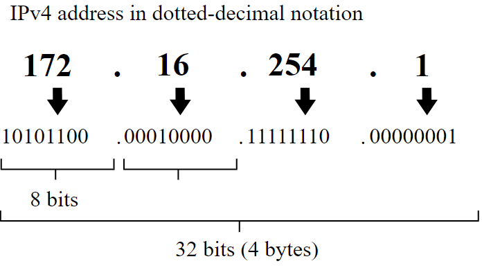
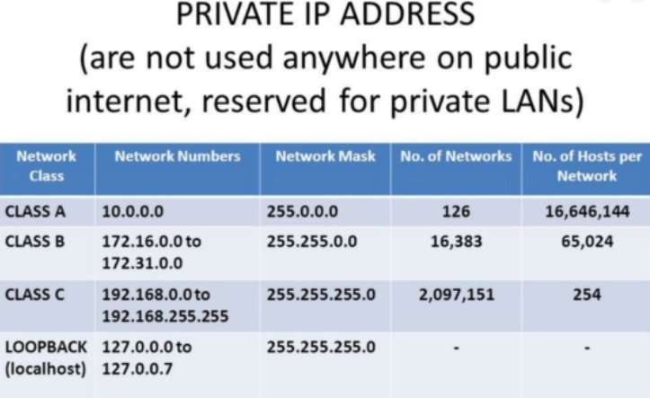
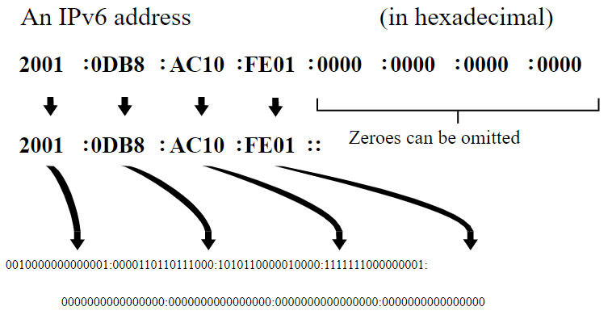

# IP Addresses

**Inet**: [IPV4](https://www.juniper.net/documentation/en_US/junos/topics/topic-map/security-interface-ipv4-ipv6-protocol.html), decimal notation. 

**Inet6**: [IPV6](https://www.juniper.net/documentation/en_US/junos/topics/topic-map/security-interface-ipv4-ipv6-protocol.html), hexadecimal notation 3.4

Both are used during the layer 3 of OSI model, which in other words is the router.

## IPV4
Due to limitation in how many IPV4 IPs there are, Network Address Translator ([NAT](https://www.youtube.com/watch?v=FTUV0t6JaDA)) is used.

Most common private IP addresses classes are A, B and C. All these IPs are distributed at the router. 

## IPV6

