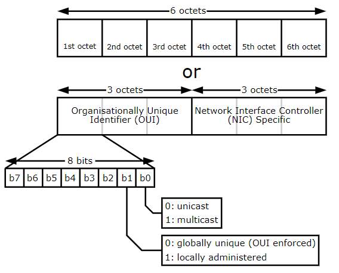

# MAC Address
Everything that uses a network interface has a Media Access Control ([MAC](https://www.youtube.com/watch?v=UrG7RTWIJak)) address. It is used during the layer 2 of OSI model, meaning in Switches (not Nintendo).




# MAC Spoofing
It is a process of changing your factory assigned MAC to something else. For example it can be used to conceal your real MAC for privacy purposes or to pretend to be some other device.


## MAC Spoofing on Linux

On linux this is possible via the use of [macchanger](https://github.com/acrogenesis/macchanger). 

#### View network interfaces
First lets see which network interfaces there are, using `ifconfig`.
```bash
~$ sudo ifconfig
eth0: flags=4163<UP,BROADCAST,RUNNING,MULTICAST>  mtu 1500
        inet 192.168.222.129  netmask 255.255.255.0  broadcast 192.168.222.255
        inet6 fe80::20c:29ff:fe95:1acf  prefixlen 64  scopeid 0x20<link>
        ether 00:0c:29:95:1a:cf  txqueuelen 1000  (Ethernet)
        RX packets 4  bytes 682 (682.0 B)
        RX errors 0  dropped 0  overruns 0  frame 0
        TX packets 27  bytes 2313 (2.2 KiB)
        TX errors 0  dropped 0 overruns 0  carrier 0  collisions 0

lo: flags=73<UP,LOOPBACK,RUNNING>  mtu 65536
        inet 127.0.0.1  netmask 255.0.0.0
        inet6 ::1  prefixlen 128  scopeid 0x10<host>
        loop  txqueuelen 1000  (Local Loopback)
        RX packets 12  bytes 556 (556.0 B)
        RX errors 0  dropped 0  overruns 0  frame 0
        TX packets 12  bytes 556 (556.0 B)
        TX errors 0  dropped 0 overruns 0  carrier 0  collisions 0
```
As you can see I have a `eth0` and the loopback interface `lo`. For wired connections the network interface starts with `ethX`, `0` being the first one. For wireless connection it starts with `wlan0`. We also see the MAC address `00:0c:29:95:1a:cf`.

#### View MAC address
Using `macchanger` we also can see the MAC address for `eth0`. The `-s` stands for `show`.
```bash
~$ sudo macchanger -s eth0
Current MAC:   00:0c:29:95:1a:cf (VMware, Inc.)
Permanent MAC: 00:0c:29:95:1a:cf (VMware, Inc.)
```

#### Turning off the network and changing MAC address
In order to be able to change the MAC address, we need to shutdown the network interface for `eth0`, this is achieved as such:

```bash
~$ sudo ifconfig down
```

Now that the network interface for `eth0` is down, we can change the MAC address to a random one or a specific one.

##### Random MAC
```bash
~$ sudo macchanger -r eth0
Current MAC:   00:0c:29:95:1a:cf (VMware, Inc.)
Permanent MAC: 00:0c:29:95:1a:cf (VMware, Inc.)
New MAC:       e6:e2:29:34:e3:9c (unknown)
```

##### Specific MAC
When changing to a specific MAC, it is important to get the OUI right to appear as authentic as possible. List of OUI can be seen using `macchanger`, with the option `-l`.

```bash
~$ sudo macchanger -l
...
18037 - d4:cb:af - Nokia Corporation
18038 - d4:ce:b8 - Enatel LTD
18039 - d4:cf:f9 - Shenzhen Sen5 Technology Co., Ltd.
18040 - d4:d1:84 - ADB Broadband Italia
18041 - d4:d2:49 - Power Ethernet
18042 - d4:d5:0d - Southwest Microwave, Inc
18043 - d4:d7:48 - CISCO SYSTEMS, INC.
18044 - d4:d8:98 - Korea CNO Tech Co., Ltd
18045 - d4:d9:19 - GoPro
...
```
In this scenario I would like to pretend to be a GoPro device, to do so I add `d4:d9:19` to the first three octets, in combination with using the option `-m` in `macchanger`.

```bash
~$ sudo macchanger -m d4:d9:19:00:00:00 eth0
Current MAC:   e6:e2:29:34:e3:9c (unknown)
Permanent MAC: 00:0c:29:95:1a:cf (VMware, Inc.)
New MAC:       d4:d9:19:00:00:00 (GoPro)
```


#### Turning on eth0 interface
Once you are done assigning the MAC address, to turn on `eth0` simply use `up` for `ifconfig`.

```bash
~$ sudo ifconfig eth0 up
```


