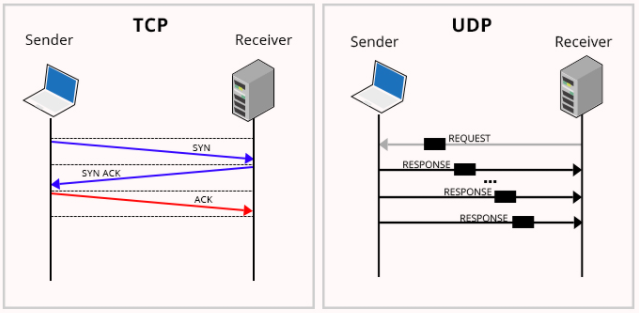
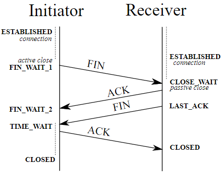

# TCP & UDP

Part of layer 4 in OSI model.

## Transmission Control Protocol (TCP)
Connection oriented protocol who focuses on high reliability by awaiting for acknowledgment from the receiver. As the name implies it controls the connection with the receiver and ensures data packets to be delivered and received reliably. 

### 3-Way Handshake

#### Example from Wireshark

Looking at the below example from Wireshark, we can observe that the source `192.168.222.130` is establishing connection to `172.217.20.35` via the source port `49598` to target port `443`.

- **Step 1**: The source sends a request to the target, that the source wishes to establish connection, `[SYN]`.
- **Step 2**: The target acknowledges the request `[SYN, ACK]`.
- **Step 3**: The source acknowledges the connection and now data can be sent from port `49598` to target port `443` and vice versa. 

## User Datagram Protocol (UDP)
A request/response oriented protocol who does not ensure that all datagram will arrive at the same time or arrive at all.

